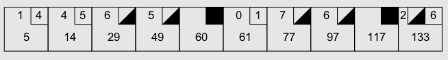

## Scoring

In ten-pin bowling there are 10 frames per game. A strike occurs when all 10 pins are knocked down on a bowler's first roll. A spare occurs when there are pins standing after the first roll, and the bowler knocks down the rest of the pins on the second roll. A spare gives the bowler an amount of "bonus pins" equal to the next roll, and a strike gives the bowler an amount of bonus pins equal to the sum of the next two rolls.

### concept of the last completed frame?

the score of the game at any point in time is the score in the last completed frame.

A completed frame is a frame that you can write the score into, right?

Yes, a frame with a spare in it completes after the next ball. A frame with a strike in it completes after the next two balls. A frame with no mark completes after the second ball in the frame.

### An Overview of the Rules of Bowling

Bowling is a game that is played by throwing a cantaloupe-sized ball down a narrow alley toward ten
wooden pins. The object is to knock down as many pins as possible per throw.
The game is played in ten frames. At the beginning of each frame, all ten pins are set up. The player
then gets two tries to knock them all down.
If the player knocks all the pins down on the first try, it is called a “strike,” and the frame ends.
If the player fails to knock down all the pins with his first ball, but succeeds with the second ball, it is
called a “spare.”
After the second ball of the frame, the frame ends even if there are still pins standing.
A strike frame is scored by adding ten, plus the number of pins knocked down by the next two balls, to
the score of the previous frame.
A spare frame is scored by adding ten, plus the number of pins knocked down by the next ball, to the
score of the previous frame.
Otherwise, a frame is scored by adding the number of pins knocked down by the two balls in the frame
to the score of the previous frame.
If a strike is thrown in the tenth frame, then the player may throw two more balls to complete the score
of the strike.
Likewise, if a spare is thrown in the tenth frame, the player may throw one more ball to complete the
score of the spare.
Thus, the tenth frame may have three balls instead of two.

The score card above shows a typical, if rather poor, game.
In the first frame, the player knocked down 1 pin with his first ball and four more with his second.
Thus, his score for the frame is a five.
In the second frame, the player knocked down four pins with his first ball and five more with his sec-
ond. That makes nine pins total, added to the previous frame makes fourteen.
In the third frame, the player knocked down six pins with his first ball and knocked down the rest with
his second for a spare. No score can be calculated for this frame until the next ball is rolled.