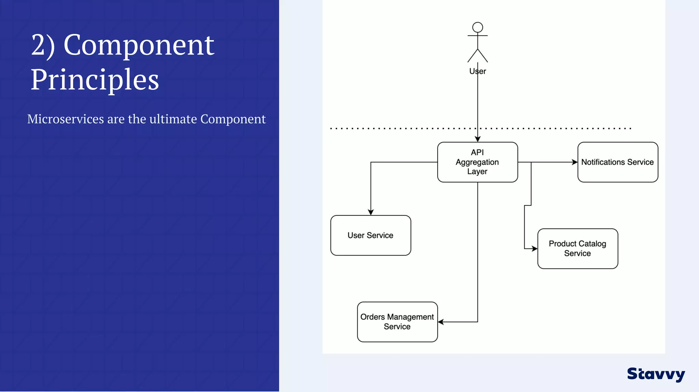
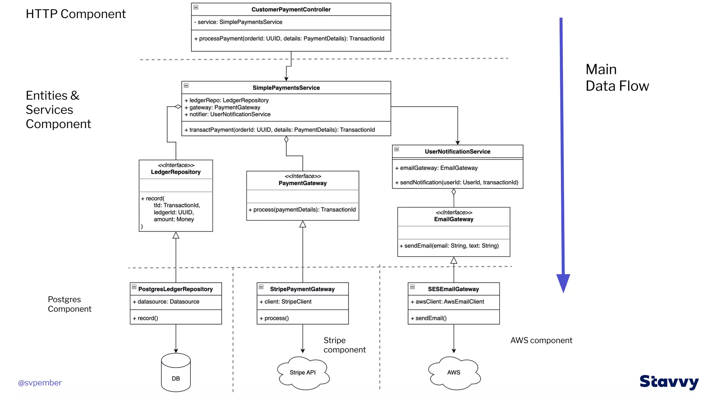

## anatomy-of-a-spring-boot-app-with-clean-architecture

See https://www.slideshare.net/StevePember/anatomy-of-a-spring-boot-app-with-clean-architecture-spring-io-2023
See https://github.com/spember/spring-shoestore

See https://www.slideshare.net/mattiabattiston/real-life-clean-architecture-61242830
See https://www.slideshare.net/mattiabattiston/real-life-clean-architecture-61242830

 

 

 

 

 

 

 

 

 

 

 

 

 

 

 

 

 

 

 

 

 

 

 

 

 

 

 

 

 

 

 

 

 

 

