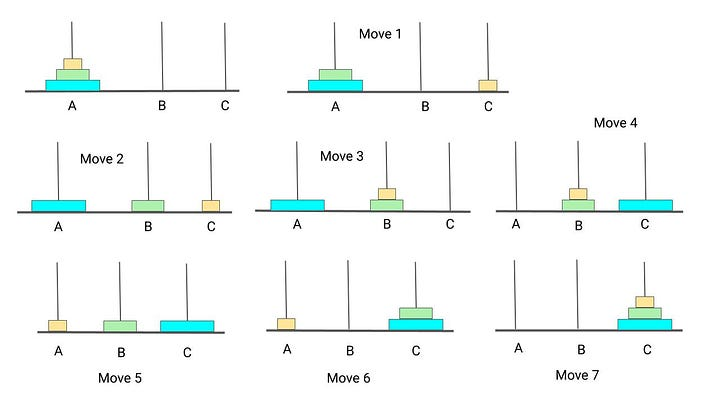

See https://www.enjoyalgorithms.com/blog/divide-and-conquer

See https://www.enjoyalgorithms.com/blog/recursion-explained-how-recursion-works-in-programming

## Tower of Hanoi

The objective of the puzzle is to move the entire stack to the last rod, obeying the following rules:

1. Only one disk may be moved at a time.
2. Each move consists of taking the upper disk from one of the stacks and placing it on top of another stack or on an empty rod.
3. No disk may be placed on top of a disk that is smaller than it.