See https://www.happycoders.eu/java/filechannel-memory-mapped-io-locks/
See https://github.com/SvenWoltmann/filechannel-bytebuffer-memory-mapped-io-locks/tree/main

### What is a FileChannel?

A Channel is a communication link to a file, socket, or another component that provides I/O functionality. Unlike InputStream or OutputStream, a Channel is bidirectional, which means you can use it for both writing and reading.

A FileChannel is a Channel for connecting to a file.

### What is a ByteBuffer?

A ByteBuffer is basically a byte array (on the Java heap or in native memory), combined with write and read methods. This encapsulation allows writing to or reading from the ByteBuffer without having to know the position of the written / read data within the actual array.

You can learn how exactly a ByteBuffer works in the ByteBuffer main article.

### File access with FileChannel + ByteBuffer

To write data into a FileChannel or read from it, you need a ByteBuffer.

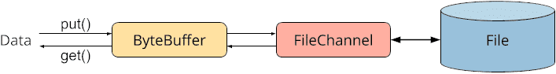

Data is put into the ByteBuffer with put() and then written from the buffer to the file with FileChannel.write(buffer). FileChannel.write() calls get() on the buffer to retrieve the data.

Using FileChannel.read(buffer) data is read from the file. The read() method puts the data into the ByteBuffer with put(), and from there, you can retrieve it with get().

### Advantages of FileChannel

FileChannel provides the following advantages over the FileInputStream and FileOutputStream classes introduced in the first two parts of the series:

- You can read and write at any position within the file.
- You can force the operating system to write changed data from the cache to the storage medium.
- You can map sections of a file to memory ("memory-mapped file"), which allows very efficient data access.
- You can set locks on file sections so that other threads and processes cannot access them simultaneously.
- Data can be transferred very efficiently from one channel to another.

### What Is a Bytebuffer, and What Do We Need It For?

You need a ByteBuffer to write data to or read data from a file, a socket, or another I/O component using a so-called “Channel”. 

A ByteBuffer is a wrapper around a byte array and provides methods for convenient writing to and reading from the byte array. The ByteBuffer internally stores the read/write position and a so-called “limit”.

### How to Create a ByteBuffer

First, you must create a ByteBuffer with a given size (“capacity”). There are two methods for this:

- ByteBuffer.allocate(int capacity)
- ByteBuffer.allocateDirect(int capacity)

The capacity parameter specifies the size of the buffer in bytes.

The allocate() method creates the buffer in the Java heap memory, where the Garbage collector will remove it after use.

allocateDirect(), on the other hand, creates the buffer in native memory, i.e., outside the heap. Native memory has the advantage that read and write operations are executed faster. The reason is that the corresponding operating system operations can access this memory area directly, and data does not have to be exchanged between the Java heap and the operating system first. The disadvantage of this method is higher allocation and deallocation costs.


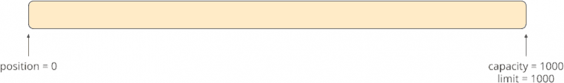

###  ByteBuffer Position, Limit, and Capacity

The printed metrics mean:

- position is the read/write position. It is always 0 for a new buffer.
- limit has two meanings: When we write to the buffer, limit indicates the position up to which we can write. When we read from the buffer, limit indicates up to which position the buffer contains data. Initially, a ByteBuffer is always in write mode, and limit is equal to capacity – we can fill the empty buffer up to the end.
- capacity indicates the size of the buffer. Its value of 1,000 corresponds to the 1,000 that we passed to the allocate() method. It will not change during the lifetime of the buffer.

### The ByteBuffer Read-Write Cycle

A complete read-write cycle consists of the steps put(), flip(), get() and compact(). We will look at these in the following sections.


#### Writing to the ByteBuffer Using put()

```java
for (int i = 0; i < 100; i++) {
  buffer.put((byte) 1);
}

printMetrics(buffer);
```


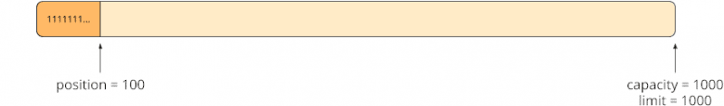


```java
byte[] twos = new byte[200];
Arrays.fill(twos, (byte) 2);
buffer.put(twos);

printMetrics(buffer);
```

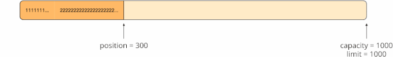

#### Switching to Read Mode with Buffer.flip()

Since position indicates not only the write position but also the read position, we must set position back to 0.

At the same time, we set limit to 300 to indicate that one can read a maximum of 300 bytes from the buffer.

In the program code, we do this as follows:

```java
buffer.limit(buffer.position());
buffer.position(0);
```

Since these two lines are needed every time you switch from write to read mode, there is a ByteBuffer method that does exactly the same for us:


```java
buffer.flip();
```

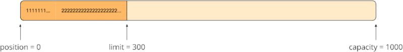

#### Reading from the ByteBuffer with get()


```java
buffer.get(new byte[200]);
```

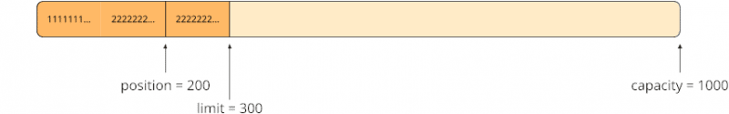

#### Switching to Write Mode – How Not to Do It

To write back to the buffer now, you could make the following mistake: You set position to the end of the data, i.e., 300, and limit back to 1,000, which brings us back to precisely the state we were in after writing the ones and twos:


Let’s assume that we would now write 300 more bytes into the buffer. The buffer would then look like this:

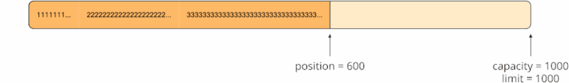

if we would now use flip() to switch back to read mode, position would be back to 0:

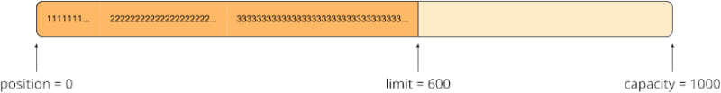

Now, however, we would read the first 200 bytes, which we’ve already read, once more.

#### Switching to Write Mode with Buffer.compact()

Instead, we must proceed as follows when switching to write mode:

- We calculate the number of remaining bytes: remaining = limit - position. In the example, this results in 100.
- We move the remaining bytes to the beginning of the buffer.
- We set the write position to the end of the bytes shifted left. That’s 100 in the example.
- We set limit to the end of the buffer.

ByteBuffer also provides a convenience method for this:

```java
buffer.compact();
```

After invoking compact()

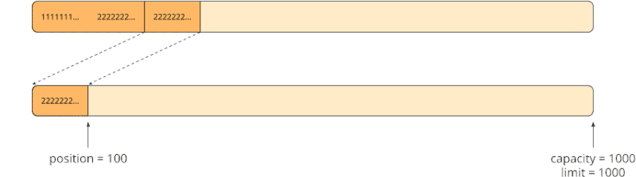

#### The Next Cycle

Now we can write the next 300 bytes into the buffer:

```java
byte[] threes = new byte[300];
Arrays.fill(threes, (byte) 3);
buffer.put(threes);
```

After writing the threes, position has shifted to the right by 300 bytes:

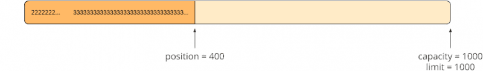

Now we can easily switch back to read mode using flip():

```java
buffer.flip();
```

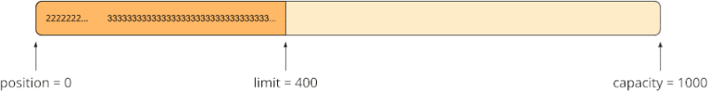
